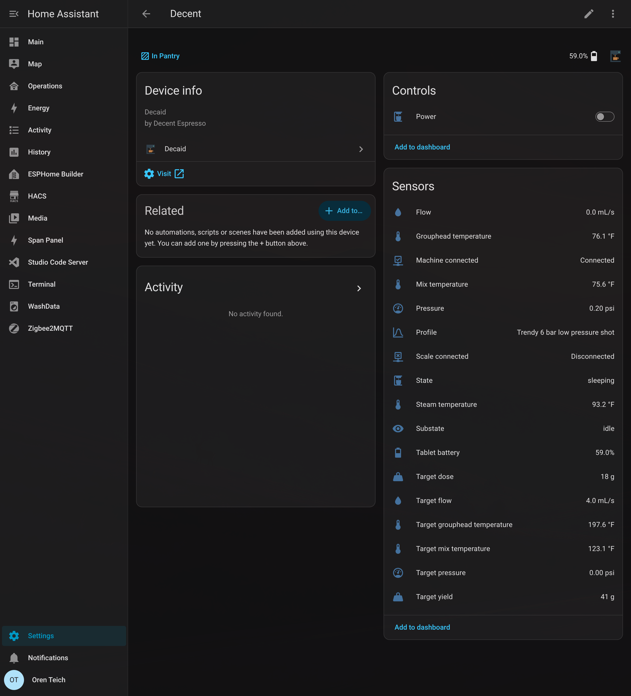

# Decaid for Home Assistant

Bring your Decent Espresso machine into Home Assistant through [Decaid](https://github.com/decentespresso/decaid)'s local API.

Plain REST YAML works for readings and wake/sleep control, but it doesn't group those entities into a Home Assistant device. This integration puts them together under one **Decent** device, with setup through the UI and installation through HACS.

## What you get

- Wake/sleep switch that only sends a wake command when the machine is sleeping.
- Live state, substate, temperatures, pressure, flow, and their targets over WebSocket. State changes appear immediately; numerical updates are limited to about once per second.
- Live machine/scale connectivity. Profile, dose/yield targets, and tablet battery refresh over REST every 60 seconds.
- Water level and refill threshold in millimeters over WebSocket. These are read-only sensors; the threshold is the value reported by the machine.
- Scale weight (g), weight flow (g/s), battery (%), and timer (ms) over WebSocket. Battery and timer are unknown when the scale does not report them; an unset timer is also unknown.
- Shot phase, last shot stop reason, and a scale-lost-during-shot indicator from Decaid's sequencer, plus a Shot event entity for automations.

After a successful wake/sleep command, the switch shows the requested state while the machine catches up, for up to 20 seconds. Fresh readings confirm it or restore the reported state.

Commands still use REST. The sleep command can interrupt a running operation.

Connections stay open with heartbeat checks and automatic reconnects. If streaming fails, machine readings fall back to REST every 1–2 seconds while awake or 10 seconds while sleeping/unreachable; device connectivity falls back to 60-second polling. A disconnected machine’s readings are unavailable until fresh data arrives.

Water levels have no REST GET fallback. The water sensors remain unavailable until their first frame and become unavailable if their stream fails, stops delivering data for 15 seconds, or the machine disconnects. Fresh frames restore them automatically.

Scale readings also use streaming without REST fallback. They become unavailable on scale disconnect, stream failure, or 15 seconds without fresh measurements. A scale reconnect needs a fresh measurement before readings become available again. Numerical updates are limited to about once per second.

## Shot events

The **Shot event** entity emits `state`, `decision`, and `terminal` events individually, without throttling. Its attributes include `shot_id`, `phase`, `source_timestamp`, `scale_lost`, and `decision` (kind, reason, and any additional context supplied by Decaid). The first frame after connecting restores the current shot sensors but does not fire an event, since Decaid replays its latest frame. Events missed while disconnected cannot be recovered from this feed.

**Last shot stop reason** retains the latest stop, abort, or terminal reason received during this integration session; a later finalize event does not overwrite it. **Scale lost during shot** follows Decaid's flag, which remains set for the rest of a shot even if the scale reconnects.

This feed describes Decaid's app-side sequencer. In full gateway mode no sequencer runs, so the feed stays idle. Shot phase is separate from the existing machine State/Substate sensors. Unlike continuous measurements, the shot stream may stay quiet between events; heartbeat checks keep its availability current.

Upgrading from 0.1? Update in HACS and restart Home Assistant. Existing entities and automations keep their IDs; no reconfiguration is needed.

## State and readiness

**State** reports the operation (`sleeping`, `idle`, `espresso`, `needsWater`, etc.). **Substate** adds detail such as `preparingForShot`, `preinfusion`, and `pouring`. Decaid maps DE1 heater warm-up/stabilization to `preparingForShot`; the main state may still say `idle`.

The API snapshot has no explicit brew-ready flag. `idle` alone does not establish thermal readiness; watch grouphead/mix temperatures against their targets. The integration preserves the raw states for automations.

## Install

Requires Home Assistant 2025.2+ and a tablet running Decaid with its local API reachable from Home Assistant (port `8080` by default).

1. In **HACS → Custom repositories**, add `https://github.com/teich/ha-decaid` as an **Integration**.
2. Download **Decaid — Decent Espresso** and restart Home Assistant.
3. Open **Settings → Devices & services → Add integration → Decaid**.
4. Enter your tablet's IP address and port (default `8080`). There's no automatic discovery yet. Leave the optional machine device ID blank unless you need to match a specific machine.

Use **Reconfigure** if the tablet's IP changes; your entity IDs stay the same.

Moving from REST YAML? Remove your old Decent REST sensors, commands, and template switch first. Existing entities aren't migrated automatically, so check the entity IDs used by your dashboards and automations.

## AI disclaimer

This integration was written by AI. It's an unofficial community project, with no affiliation to Decent Espresso and no warranty. Review it and use it at your own risk.

[Report an issue](https://github.com/teich/ha-decaid/issues) · [Decaid API reference](https://github.com/decentespresso/decaid/blob/main/doc/Api.md)
